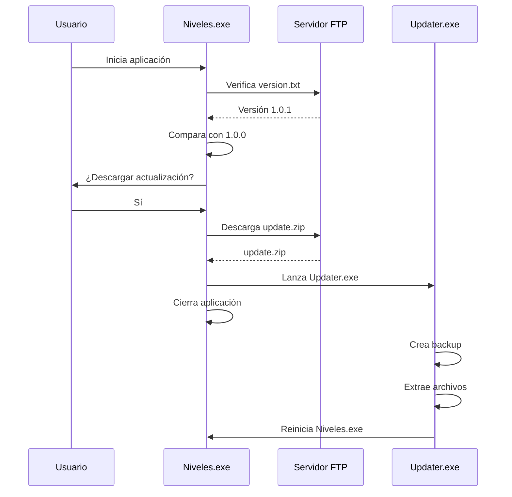

# 🚀 Sistema de Auto-Actualización - Niveles

## 📋 Resumen

Sistema completo de actualización automática para la aplicación Niveles con soporte FTP en HostGator.

## 🏗️ Componentes Creados

### 1. **UpdateManager.cs**

- **Ubicación**: `Helpers/UpdateManager.cs`
- **Funcionalidad**:
  - Conexión FTP con FluentFTP
  - Verificación de versiones
  - Descarga de actualizaciones
  - Lanzamiento del updater
  - UI de progreso

### 2. **Updater.exe**

- **Ubicación**: `Updater/` (proyecto separado)
- **Funcionalidad**:
  - Espera cierre de aplicación principal
  - Crea backup automático
  - Extrae archivos de actualización
  - Reemplaza archivos
  - Reinicia aplicación

### 3. **UpdateConfig.json**

- **Ubicación**: Raíz del proyecto
- **Contenido**: Configuración FTP y versión actual

## 📦 Instalación y Configuración

### Paso 1: Instalar FluentFTP

Ejecuta en la Consola del Administrador de Paquetes de Visual Studio:

```powershell
Install-Package FluentFTP
```

O usando .NET CLI:

```bash
dotnet add package FluentFTP
```

### Paso 2: Compilar Updater.exe

1. Abre la solución `Niveles.sln`
2. Agrega el proyecto Updater a la solución:
   - Click derecho en la solución → "Agregar" → "Proyecto existente"
   - Selecciona `Updater/Updater.csproj`
3. Compila el proyecto Updater en modo **Release**
4. Copia `Updater.exe` desde `Updater/bin/Release/` a la carpeta raíz de Niveles

### Paso 3: Configurar UpdateConfig.json

Edita `UpdateConfig.json` con tus credenciales FTP de HostGator:

```json
{
  "FtpSettings": {
    "Host": "ftp.tudominio.com",
    "Username": "tu_usuario_ftp@tudominio.com",
    "Password": "tu_password_seguro",
    "UpdatesPath": "/public_html/niveles/updates/",
    "VersionFile": "version.txt",
    "UpdatePackage": "update.zip"
  },
  "AppSettings": {
    "CurrentVersion": "1.0.0",
    "CheckUpdateOnStartup": true,
    "AutoDownload": true,
    "UpdaterExeName": "Updater.exe"
  }
}
```

## 🌐 Configuración del Servidor FTP (HostGator)

### Estructura de Directorios

Crea la siguiente estructura en tu FTP:

```
/public_html/
└── niveles/
    └── updates/
        ├── version.txt
        ├── update.zip
        └── changelog.txt (opcional)
```

### Archivos del Servidor

#### `version.txt`

Contiene solo el número de versión:

```
1.0.1
```

#### `update.zip`

Archivo ZIP que contiene:

```
Niveles.exe
Niveles.dll
[otros archivos actualizados]
```

**IMPORTANTE**:

- NO incluir `UpdateConfig.json` en el ZIP
- NO incluir `Updater.exe` en el ZIP
- Solo incluir archivos que cambiaron

#### `changelog.txt` (opcional)

```
Versión 1.0.1 - 21/11/2025
- Corrección de bugs en panel de valores
- Mejoras de rendimiento
- Nueva funcionalidad de colores
```

## 🔄 Flujo de Actualización



## 🛠️ Cómo Publicar una Actualización

### 1. Preparar la Nueva Versión

```bash
# 1. Actualiza la versión en UpdateConfig.json
{
  "AppSettings": {
    "CurrentVersion": "1.0.1",  # ← Incrementa aquí
    ...
  }
}

# 2. Compila en Release
# En Visual Studio: Build → Configuration Manager → Release
```

### 2. Crear update.zip

```powershell
# Desde PowerShell en la carpeta bin/Release/
Compress-Archive -Path Niveles.exe,*.dll -DestinationPath update.zip
```

O manualmente:

1. Selecciona los archivos actualizados
2. Click derecho → "Enviar a" → "Carpeta comprimida"
3. Renombra a `update.zip`

### 3. Subir al FTP

```bash
# Usando FileZilla o tu cliente FTP favorito:
1. Conecta a ftp.tudominio.com
2. Navega a /public_html/niveles/updates/
3. Sube update.zip (sobrescribe el anterior)
4. Edita version.txt y cambia a "1.0.1"
```

### 4. Verificar

1. Cierra Niveles si está abierto
2. Inicia Niveles.exe
3. Debe aparecer el mensaje de actualización
4. Acepta y verifica que se descarga e instala

## 🔒 Seguridad

### Recomendaciones

1. **Credenciales FTP**:

   - Usa un usuario FTP dedicado solo para actualizaciones
   - Limita permisos solo a la carpeta `/niveles/updates/`

2. **HTTPS/FTPS**:

   - Si HostGator lo soporta, usa FTPS en lugar de FTP
   - Modifica `UpdateManager.cs`:

   ```csharp
   client.Config.EncryptionMode = FtpEncryptionMode.Explicit;
   client.Config.ValidateAnyCertificate = true;
   ```

3. **Validación de Archivos**:
   - Considera agregar checksums MD5/SHA256
   - Valida integridad del ZIP antes de extraer

## 🐛 Solución de Problemas

### Error: "No se encontró UpdateConfig.json"

- Verifica que `UpdateConfig.json` esté en la misma carpeta que `Niveles.exe`
- Asegúrate de que se copie al directorio de salida (Build Action: Content, Copy Always)

### Error: "No se puede conectar al servidor FTP"

- Verifica credenciales en `UpdateConfig.json`
- Prueba conexión con FileZilla
- Revisa firewall/antivirus

### Error: "Updater.exe no encontrado"

- Copia `Updater.exe` a la carpeta de Niveles
- Verifica que el nombre coincida con `UpdaterExeName` en config

### La actualización no se detecta

- Verifica que `version.txt` en FTP tenga formato correcto (solo número)
- Compara versiones: FTP debe ser > local
- Revisa que la ruta FTP sea correcta

## 📝 Notas Adicionales

### Desarrollo vs Producción

Para evitar actualizaciones durante desarrollo:

```json
{
  "AppSettings": {
    "CheckUpdateOnStartup": false,  # ← Desactiva en desarrollo
    ...
  }
}
```

### Actualización Manual

Los usuarios pueden forzar una verificación agregando un botón:

```csharp
private async void btnCheckUpdates_Click(object sender, EventArgs e)
{
    var updateManager = new UpdateManager();
    await updateManager.CheckAndUpdateAsync();
}
```

### Logs

El Updater muestra progreso en consola. Para logs persistentes, modifica `Updater/Program.cs`:

```csharp
File.AppendAllText("updater.log", $"{DateTime.Now}: {mensaje}\n");
```

## ✅ Checklist de Despliegue

- [ ] FluentFTP instalado en proyecto Niveles
- [ ] Updater.exe compilado y copiado
- [ ] UpdateConfig.json configurado con credenciales FTP
- [ ] Estructura de carpetas creada en FTP
- [ ] version.txt subido con versión inicial
- [ ] update.zip de prueba subido
- [ ] Probado flujo completo de actualización
- [ ] Documentación entregada al equipo

## 🎯 Próximos Pasos

1. Compila el proyecto Updater
2. Instala FluentFTP en el proyecto principal
3. Configura tus credenciales FTP
4. Prueba con una actualización de prueba
5. ¡Listo para producción!

---

**¿Necesitas ayuda?** Revisa los logs del Updater o contacta al equipo de desarrollo.
